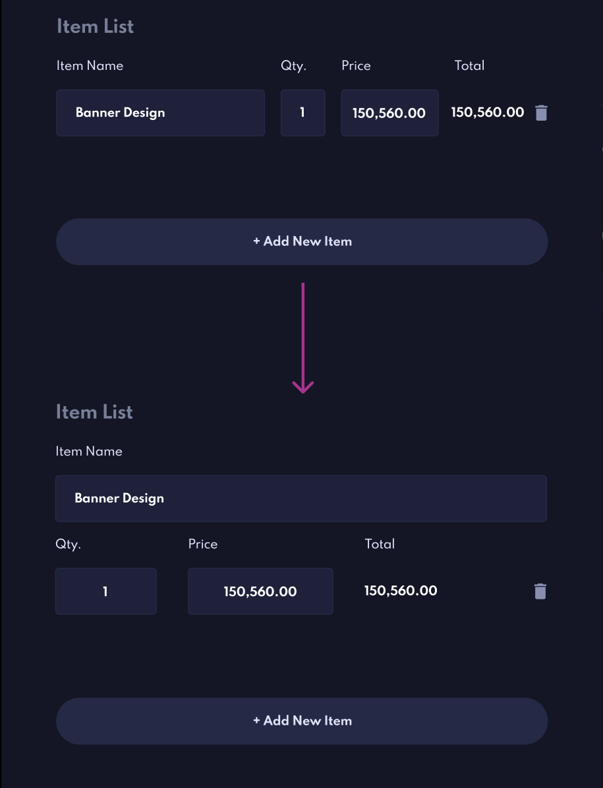

# Invoice App - Frontend Mentor

### Preview:

Howdy!

Thank you for checking out my solution to the [InvoiceApp challenge](https://www.frontendmentor.io/challenges/invoice-app-i7KaLTQjl) from [FrontendMentor](https://www.frontendmentor.io)!

This is my first 'well documented' project where I spent a lot of time and effort on really grasping concepts and comitting my code much more often and correctly than in the past, I hope it doesn't dissapoint too much 😁

## Overview

### Philosophy
I tend to have one objective with anything I do. Make it as simple as possible. If  I can write less code that does the same thing and remains readable and easy to grasp, I will do so. If I can avoid using a library that I don't know what it does, I will avoid it. My brains struggles with 'magical' solutions so I seek simple solutions first before outsourcing. 

Svelte is an amazing tool for understanding what you're building. Mixed with Firebase everything was fairly minimal to set up, perhaps to follow also.

### Tools I used 🛠:

- **Svelte**: to build the project with, love using this as my first framework 🥰
    - HTML, CSS, SCSS, JS (mostly helper functions and authentication etc)
- **Firebase**: For authentication and data management

### Cool features I spent time on 😊:

I worked on the below to ensure full 'immersion' for the user. These were challenges that were new to me 
and I wanted to deliver the best possible design & UI experience. 

- Custom datepicker: This was an intimidating one to create! Explanations below.
- 'Custom' filter buttons: I wanted to build a completely custom experience.
- Login & Sign up forms (first Authentication project, apart from security improvements I think I did alright..)

## What I've learned

This was my first time building a project this big, with so much data flowing in and out of componenets 
that quite frankly the entire project was an amazing learning experience.

But here's a list:
- **Creating a datepicker**: This was challenging as I basically sucked at dates when first learning JS. I couldn't grasp the concepts quickly enough. So I decided to spend a Sunday on codepen and just build it from scratch. I ended up building the entire datepicker in vanilla JS by myself with some documentation-aid from MDN. I later converted and refactored this with Svelte. It was an euphoric sort of headache.
- **Difficulty of data structure**: I was a bit blown away and intimidated when studying the design, pondering on how all the data will flow. Whilst being a newbie I'm fascinated with building things that are easy to read, scalable and minimal. And I am now walking away with a new appreciation of why software development, web development etc takes so much time, money and effort. It is extremely difficult to build something GREAT that can be scaled in the future. Amazing lesson to have.
- **Trusting myself with UI**: I altered a smidge of the original design. I found that the design struggled when invoice items had large numbers. So I tweaked the design to be focused on the best way to represent the data, image1 below.
- **Playing with a new variable system for dark/light col scheme**: I decided to do a slightly 'longer' color scheme variable system. First i created variables for all colors specified in the design files. I then created new variables that were symantically specific to the components and elements they were to be used for. I was experimenting with this to see if I could create more maintanable variables that could be simple (even if slightly long) to edit in the future. An example would be: *--invoice-main-text-col: var(--primary)*.
- **Potential authentication security issues**: This is one I'll spend more time on in the future. Just realising how something is vulnerable based on the tool and data flow was an interesting lesson. I defenitely need to school myself up on this.
- **Flexbox ain't as simple as it pretends to be...**: I'm sure I'm not alone in saying that Flexbox only pretends to be simple. There's actually a lot of implicit actions being taken in the background and it was interesting learning about them. For example, did you know that Flexbox cancels CSS' natural behaviour of collapsing margins??? I did not. 
- **Inputs and data flow**: Small but interesting functionality added by me: When clicking/tabbing into a specific input container an input changes from *type='text'* to *type='number'*. This allows us to stop the user from inputting anything they want in a number-only field. But then it changes to text as we have a function converting the number to a string with *Number.toLocaleString()*. Then as the data is input (as a number) it turned out it was sending string-type-data to the parent Component. Overall a cool solution and lesson, I thought!

## Bugs bugs bugs 😳🐛

- I can't add pennies/cents (decimals) to my monetary number fields. Completely missed that. Looked around for a quick solution but didn't find one I liked. Might fix in the future.
- Firebase security would allow anyone who has the access to the userID to get all user data soooo it's a slightly massive security flaw. The optimal behaviour would be to only allow a user to get data if their logged in auth Uid and firebase Uid match. But for some reason this wasn't working for me, will need to study up in the future.

## What I would do differently

- In any future project I will spend more time drawing out the data-flow between and within the DB, componenents etc. It will make way for cleaner code...
- Stricter use of components. Some reusable code was never turned into components in this project. I'm still new to thinking this way but it's a poor excuse for missing out on improved maintainability.
- Used Svelte **+ Sapper** for routing. At the moment my application cannot be crawled by a search engine and has near to zero SEO. Sapper would allow me to create routes for every link and different state which is optimal.
## Screenshots

#### Image1 - UI Alternation

